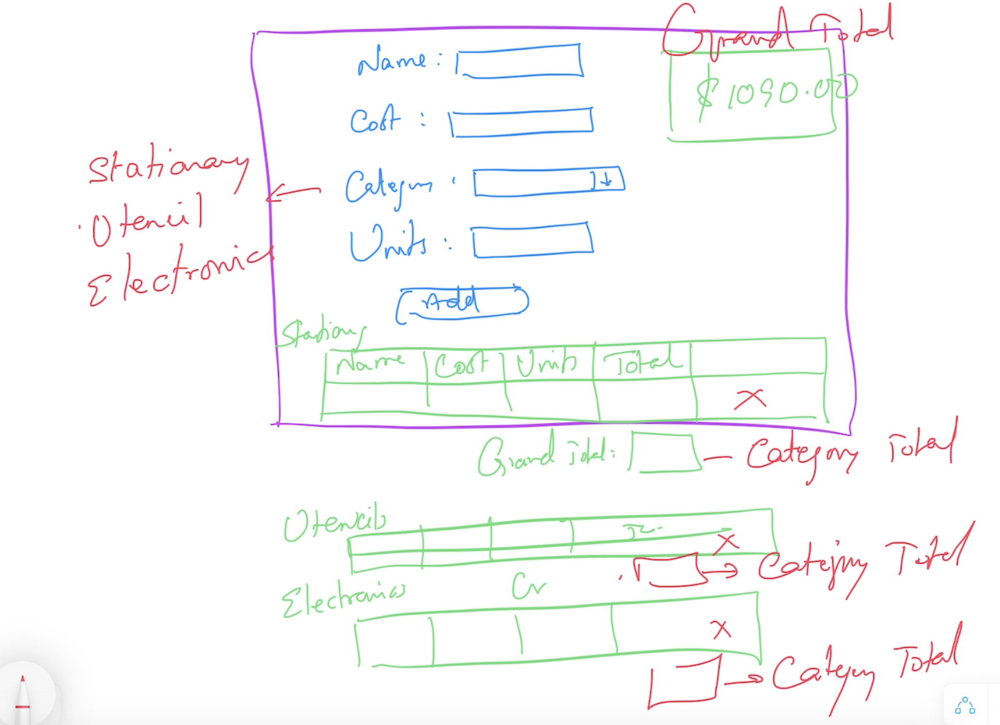

# Reference
- https://bit.ly/angular-training-videos

## Schedule
- Commence      : 10:00 AM 
- Tea Break     : 11:30 AM (15 mins)
- Lunch Break   : 1:30 PM (1 hr)
- Tea Break     : 4:00 PM (15 mins)
- Wind up       : 6:00 PM

## Software Requirements
- Visual Studio Code
- Node.js

## Methodology
- No powerpoint
- Discuss & Code

## Repository
https://github.com/tkmagesh/zeomega-angular-apr-2024

## Angular JS
- Framework for building RIA (Rich Internet Applications)

### Building Blocks

#### Controllers
    - User Interaction Behavior

#### Scope
    

#### Directives
    - Encapsulates DOM manipulation logic

#### Filters
    - Used to transform the data for presentation

For handling NON-UI responsibilities
#### Factory
#### Value
#### Constant
#### Provider
#### Services

#### Modules



## ReST (Representational State Transfer)
- Every resource (data) is accessible through a http end point (url)
- Operations are communicated using HTTP Methods
    - GET
        - retrieve the data from the server
    - POST
        - Insert new data in the server
    - PUT
        - Update the given data in the server
    - PATCH
        - Partial update the given data in the server
    - DELETE
        - Remove the data in the server

## JSON server
    - Serve the data from a json file as rest end points

```
(From the folder that has the db.json file)
npx json-server db.json
```