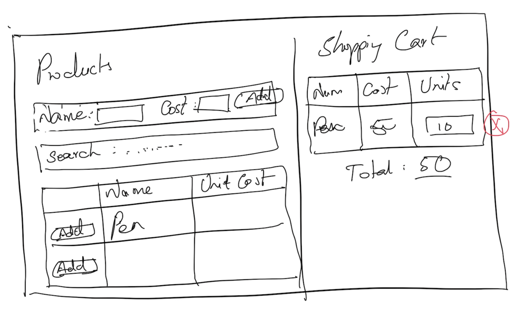

# Reference
- https://bit.ly/angular-training-videos

## Schedule
- Commence      : 10:00 AM 
- Tea Break     : 11:30 AM (15 mins)
- Lunch Break   : 1:30 PM (1 hr)
- Tea Break     : 4:00 PM (15 mins)
- Wind up       : 6:00 PM

## Software Requirements
- Visual Studio Code
- Node.js

## Methodology
- No powerpoint
- Discuss & Code

## Repository
https://github.com/tkmagesh/zeomega-angular-apr-2024

## Angular JS
- Framework for building RIA (Rich Internet Applications)

### Building Blocks

#### Controllers
    - User Interaction Behavior

#### Scope
    

#### Directives
    - Encapsulates DOM manipulation logic

#### Filters
    - Used to transform the data for presentation

For handling NON-UI responsibilities
#### Factory
#### Value
#### Constant
#### Provider
#### Services

#### Modules


## ReST (Representational State Transfer)
- Every resource (data) is accessible through a http end point (url)
- Operations are communicated using HTTP Methods
    - GET
        - retrieve the data from the server
    - POST
        - Insert new data in the server
    - PUT
        - Update the given data in the server
    - PATCH
        - Partial update the given data in the server
    - DELETE
        - Remove the data in the server

## JSON server
    - Serve the data from a json file as rest end points

```
(From the folder that has the db.json file)
npx json-server@0.17.4 db.json 
```

## Evaluation Problem
```
    Check in the code in your personal github repo and share the link
```

1. Create a json file with list of products ( product => id, name, unitCost) and host it using json-server
2. Create an angular application which shows the list of products from the server
3. The angular app should allow the user to 
    a. add new products to the list
    b. search the products
4. The angular app should display an empty 'shopping cart' initially
5. The user should be able to add 1 or more products to the shopping cart
5. The user should be able to modify the "number of units" for each product in the shopping cart
6. The user should be able to remove a product from the shopping cart
6. The Cart should display the overall cart value updated (sum of unitCost * units of all the products in the cart) 



### Evaluation Criteria
- UI (20)
- Comments (10)
- Variable Names (10)
- Structuring (15)
- Maintainability (15)
- Validation (10)
- Using appropriate angular building blocks (20)